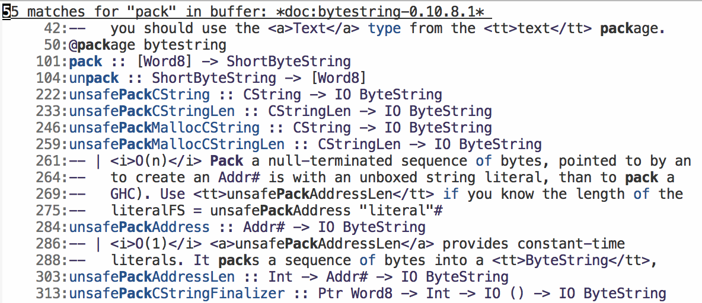

# stack-doc

Display documentation for packages in your current Stack snapshot

Run `M-x stack-doc` to see an index of all packages that you have
installed in your snapshot:

Press enter on any package to open up that package, or alternatively
to go straight to a package, use `M-x stack-doc-open` to pick a
package.

You will see the complete set of signatures and haddocks for that
package:

From here you can use regular Emacs searching utilities, such as
`isearch`:

Or `M-x list-matching-lines`:

